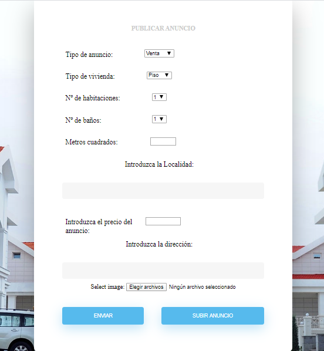
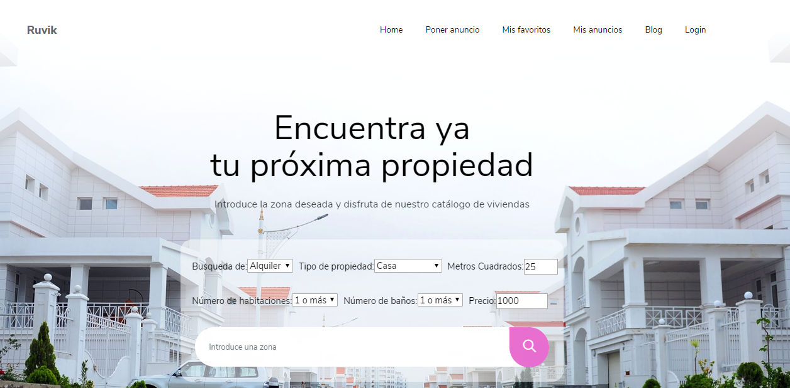
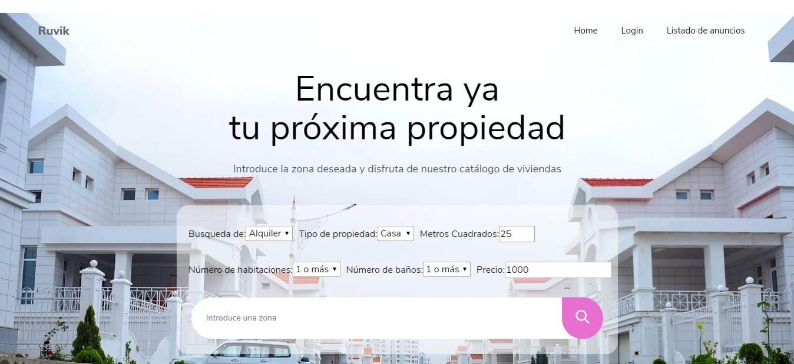
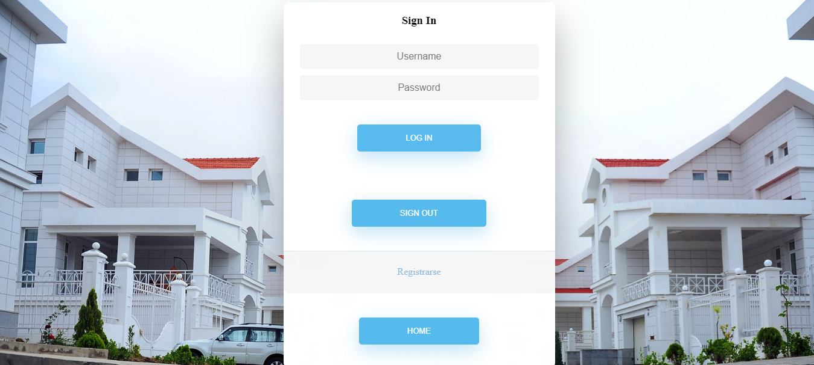

# webapp12

## FASE 0

### Nombre de App
Ruvik

### Miembros (Grupo 12)

| Nombre y Apellido    |Mail		   | Github        |
|:--------------------:|:-----------:|:--------------:|
| María Flores García | m.flores.2016@alumnos.urjc.es | mariafg11 |
| Karol Lisowski |  k.lisowski@alumnos.urjc.es |  KarolLisowski  |
| Sebastian Fila | st.fila.2016@alumnos.urjc.es  |  Sebas104  |
| Eduardo Luna Sánchez |  e.luna.2016@alumnos.urjc.es |  EduLuna  |
| Wu Li Lu |  w.lil@alumnos.urjc.es |  alilu8  |

### Herramientas de gestión de equipo
#### TRELLO
* Para organizar las tareas y asignarlas, hemos utilizado la herramienta trello:
 [Trello grupo 12](https://trello.com/b/QKFyV5xQ/practica-daw).

## Requisitos

Aplicación de anuncio de casas, locales, pisos. Para alquiler, venta etc..

* Entidades:
     - Anuncio: Un anuncio es la propiedad que se va a exponer en la página. Cada anuncio tendrá , sus imagenes, caracteristica como       número de habitaciones , metros cuadrados..
     - Comentarios: Son los comentarios que pongan los usuarios a los anuncios.
     - Blog: Un blog con novedades y recomendaciones para alquilar,comprar y vender.
     - Usuarios.
* Usuarios.
     - Usuario Anónimo: Podrá ver y buscar los anuncios.
     - Usuario Registrado: Podrá publicar sus propios anuncios, editarlos.Tendrá una sección con sus anuncios favoritos y recomendaciones personalizadas.También podrá comentar en los anuncios.
     - Usuario Administrador: Podrá eliminar todos anuncios y comentarios. Crear publicaciones en el blog. 
* Gráficos: 
     - Se genera un gráfico con las ventas generales de la aplicación, se pueden filtrar por distintos campos.
* Tecnología complementaria:
     - Enviar un email cuando el usuario registra la cuenta.

* Algoritmo o consulta avanzada: 
     - Un algoritmo que crea recomendaciones con el historial de búsqueda, y se ordenan por valoración.
     
## FASE 1
### Capturas

Sign in: Es la página de Login, el usuario podrá iniciar la sesión con su cuenta.

Sign Up: En esta página, el usuario sin cuenta podrá registrarse

Índice: Es la página principal de los usuarios registrados

Índice modo visitante: Es la página principal de los usuarios sin registrado, tiene menos funciones que los usuarios registrados

Resultado de búsqueda: Son resultados de la búsqueda

Mis anuncios: Los usuarios registrados pueden ver sus anuncios y modificarlos

Subir un nuevo anuncio: Los usuarios registrados pueden subir anuncios

Opiniones: Los usuarios registrados podrá ver las opiniones de los distintos usuarios sobre un anuncio

Opiniones modo visitante: Los usuarios sin registrar no podrá ver las opiniones.

Blog: Sólo los usuarios registrados podrá ver las novedades.

Gráfica: Muestra número de ventas de distintos meses.

### Diagrama de Navegación

## FASE 2
### Navegación

Subida de anuncios: Nuevo formulario de subida de anuncio.

Home: Nuevo Home y filtros para las búsqueda.

Admin: Html para admins. 

Login: Nuevo login. 

Gráfico: Nuevo gráfico actualizado. 

Diagrama de navegación: nuevo diagrama de navegación. 

### Instrucciones de desarrollo
#### Repositorio de Código
[Código fuente](https://github.com/CodeURJC-DAW-2019-20/webapp12).

#### Herramienta de desarrollo
* IntelliJ
* Spring Initializr
* MySQL Server 8.0
* MySQL WorkBench 8.0

#### Dependencias
* MSQL Server 8.0
* Spring framework
* Springboot starter security
* Mustache
* Springboot starter mail

#### Gestionar el proyecto Spring con IntelliJ
1. Abrir IntelliJ y seleccionar Create New Proyect.
2. Elegir Spring Initializr (Project SDK 1.8 por defecto) y dar a next.
3. Configurar el proyecto (el nombre del proyecto, tipo del proyecto (Maven), lenguaje del proyecto (Java), etc.) y dar a next.
4. Elegir la versión del Spring Boot y seleccionar las dependencias necesarias, next.
5. Elegir la ruta del proyecto y finish.
6. Añadir dependencias necesarias en pom.xml y configuración en application.properties.
7. Para compilar se da al botón Build Project (Ctrl+F9) y para ejecutar Run 'Application'(Ctrl+F10).

#### Conectar y crear esquema en MySQL
1. Descargar e instalar MySQL Server y MySQL WorkBench
2. Abrir MySQL WorkBench
3. Añadir una conexión con el usuario y la contraseña puesto en application.properties.
4. * Introducir en el comando y ejecutar: create database daw_webapp12; para crear un nuevo base de datos llamado daw_webapp12. 
   * Introducir en el comando y ejecutar: drop database daw_webapp12; cuando añadimos nuevas entidades, hay que eliminar el base de datos anterior para luego crear una nueva con entidades completas.
5. Hacer consultas con SQL.

### Diagrama con las entidades de la base de datos

### Diagrama de clases y templates

### Participación de miembros

Eduardo Luna Sánchez: 
* Tareas realizadas en la fase: 
  - Implementación del correo como tecnología complementaria. 
  - Creación de entidades. 
  - Cambio en el formulario de subida del anuncio. 
  - Realizar funcionalidades de anuncio. 
  - Realizar diagrama de las entidades de la base de datos. 
  - Realizar diagrama de clases y template. 
  - Cambios en diversos htmls. 
  
 * Listado de los 5 commits más significativos: 
   - New complementary technology 1954f33 
   - Update html 52b568e 
   - Update property-upload f9e0011
   - New class diagram and template diagram 78e4cde
   - Update entities 19f014d 
  
 * Listado de los 5 ficheros que mas se haya participado: 
   - UserController.java
   - UserService.java
   - property-upload.html
   - Advertisement.java
   - Comment.java

Wu Li Lu: 
* Tareas realizadas en la fase: 
  - Creación del proyecto Spring. 
  - Creación de BBDD.
  - Creación de entidades. 
  - Creación de páginas de error. 
  - Implementar Spring Security.
  - Realizar funcionalidades de anuncio. 
  - Realizar subida de imágenes. 
  - Implementación del correo como tecnología complementaria.
  
 * Listado de los 5 commits más significativos: 
   - Mustache configuration 556efb4
   - Add Spring Security 77fb39b
   - Update property-upload 8815174 
   - bug fixed 524db0d
   - Update multiple image upload eec2db3 
   
 * Listado de los 5 ficheros que mas se haya participado: 
   - MainController.java
   - SpringSecurityConfig.java
   - property-upload.html
   - Advertisement.java
   - LoginController.java
   
María Flores García: 

* Tareas realizadas en la fase:  
  - Creación de relaciones en BBDD.
  - Creación de entidades. 
  - Creación de header y footer. 
  - Implementar Spring Security.
  - Realizar funcionalidades de modificar anuncio. 
  - Realizar funcionalidad de búsqueda. 
  - Implementar añadir a favoritos.
  
 * Listado de los 5 commits más significativos: 
   - Edit advertisement 6948d29ad70e4b4fc8b20c9bd453e1fff4dbfd35
   - Add to my favourites e0f24dd04eaae69bc9feb52174f6f38686fc7c10
   - SignUp added ce37fdb052ff4bfff548e15498c322164e07f095 
   - Header and footer added 3da3b21bc3d9faafa70b2b849a2c44dc30a7b415
   - Search implemented 81bdd8f5abbe16525f2090c49a6b8da345bf056d 
   
 * Listado de los 5 ficheros que mas se haya participado: 
   - AdvertisementController.java
   - SpringSecurityConfig.java
   - UserRepositoryAuthenticationProvider.java
   - UserController.java
   - properties-search.html
   
   
   Karol Lisowski: 

* Tareas realizadas en la fase:  
  - Edicion html
  - Creación de entidades.
  - Creacion e implementacion de controladores, servicios y repositorios
  - Creación de gráfico dinámico. 
  - Implementación de un algoritmo de recomendación basado en las búsquedas del usuario.
  - Realizar funcionalidades de mostrar y eliminar anuncio, tanto de favoritos como de mis anuncios(del Usuario). 
  - Complementar funcionalidad de búsqueda, guardando los valores para futuras recomendaciones. 
  - Implementacion dl html que puede ver el usuario en función de su rol.
  
 * Listado de los 5 commits más significativos: 
   - Worked on the implementation of what users can see based on their role 7da4c2fda660747985a4ee1ce0c8ab48ea0b1c5e
   - Recommended advertisements algorithm fully working bbcf7580e7e1fcff67b880967827995da5bcf842
   - Deleting a User favourite avertisements fully working 81db6cdfdd8494213152f5772602de157e30cfa7
   - Fully working graph with real data d8a809015d312fab23075fd9a0085ca105252c27
   - Web Controllers for Advertisement and Blog, small html changes and... be7f6bd0918d800c2cfcbbdf8108c86f0bf16bc6 
   
 * Listado de los 5 ficheros que mas se haya participado: 
   - AdvertisementController.java
   - UserController.java
   - graph.js
   - MainController.java
   - index.html
