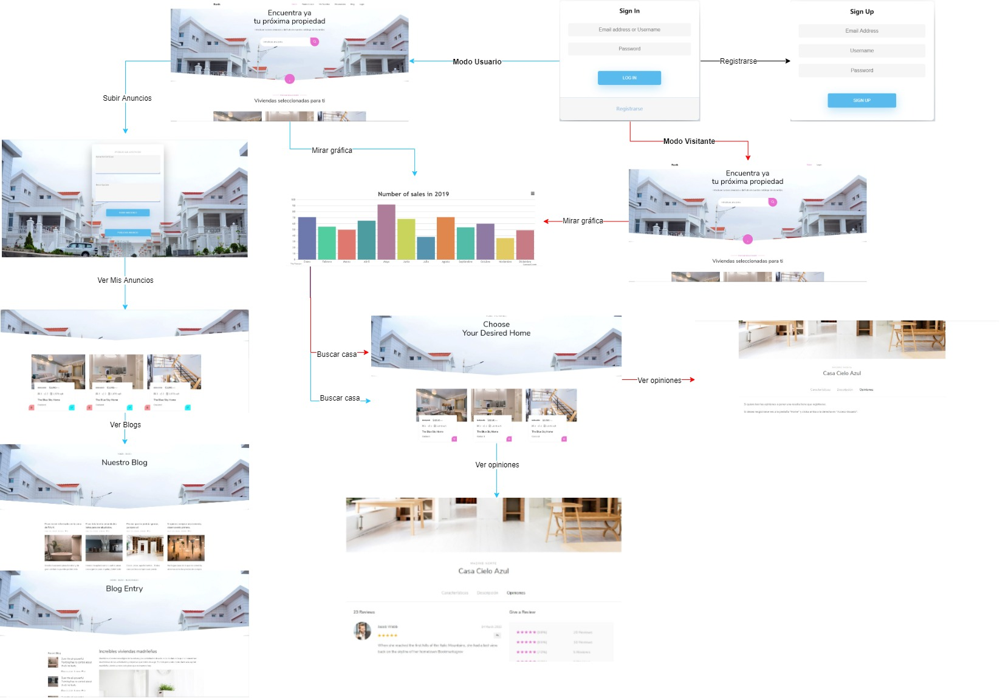
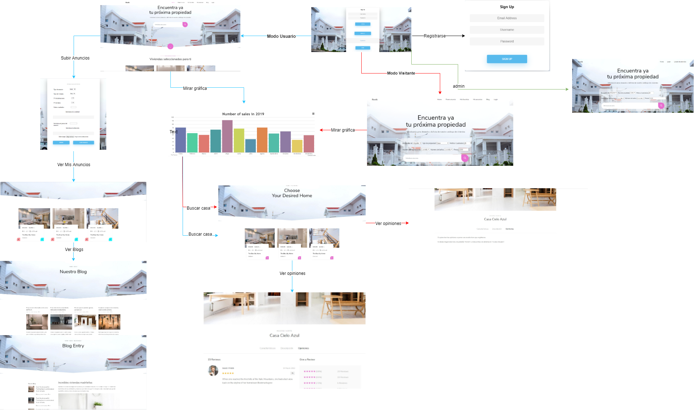
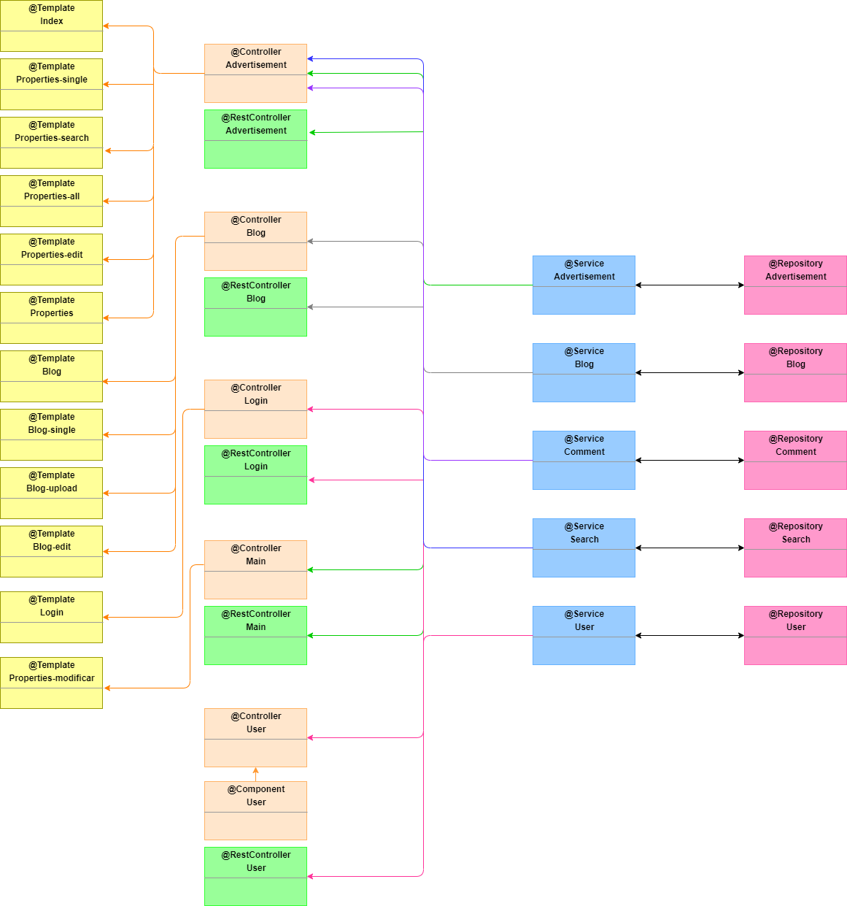
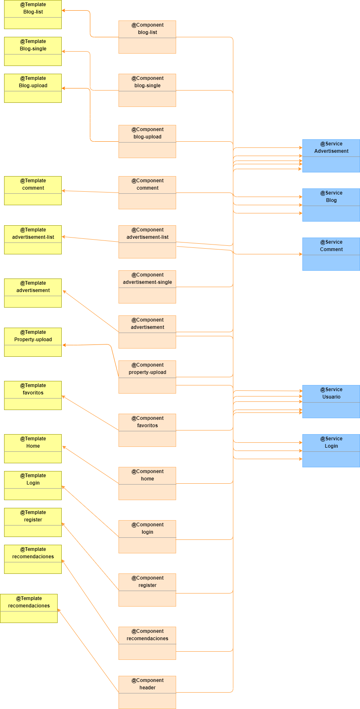

# webapp12

## FASE 0

### Nombre de App
Ruvik

### Miembros (Grupo 12)

| Nombre y Apellido    |Mail		   | Github        |
|:--------------------:|:-----------:|:--------------:|
| María Flores García | m.flores.2016@alumnos.urjc.es | mariafg11 |
| Karol Lisowski |  k.lisowski@alumnos.urjc.es |  KarolLisowski  |
| Sebastian Fila | st.fila.2016@alumnos.urjc.es  |  Sebas104  |
| Eduardo Luna Sánchez |  e.luna.2016@alumnos.urjc.es |  EduLuna  |
| Wu Li Lu |  w.lil@alumnos.urjc.es |  alilu8  |

### Herramientas de gestión de equipo
#### TRELLO
* Para organizar las tareas y asignarlas, hemos utilizado la herramienta trello:
 [Trello grupo 12](https://trello.com/b/QKFyV5xQ/practica-daw).

## Requisitos

Aplicación de anuncio de casas, locales, pisos. Para alquiler, venta etc..

* Entidades:
     - Anuncio: Un anuncio es la propiedad que se va a exponer en la página. Cada anuncio tendrá , sus imagenes, caracteristica como       número de habitaciones , metros cuadrados..
     - Comentarios: Son los comentarios que pongan los usuarios a los anuncios.
     - Blog: Un blog con novedades y recomendaciones para alquilar,comprar y vender.
     - Usuarios.
* Usuarios.
     - Usuario Anónimo: Podrá ver y buscar los anuncios.
     - Usuario Registrado: Podrá publicar sus propios anuncios, editarlos.Tendrá una sección con sus anuncios favoritos y recomendaciones personalizadas.También podrá comentar en los anuncios.
     - Usuario Administrador: Podrá eliminar todos anuncios y comentarios. Crear publicaciones en el blog. 
* Gráficos: 
     - Se genera un gráfico con las ventas generales de la aplicación, se pueden filtrar por distintos campos.
* Tecnología complementaria:
     - Enviar un email cuando el usuario registra la cuenta.

* Algoritmo o consulta avanzada: 
     - Un algoritmo que crea recomendaciones con el historial de búsqueda, y se ordenan por valoración.
     
## FASE 1
### Capturas

Sign in: Es la página de Login, el usuario podrá iniciar la sesión con su cuenta.

Sign Up: En esta página, el usuario sin cuenta podrá registrarse

Índice: Es la página principal de los usuarios registrados

Índice modo visitante: Es la página principal de los usuarios sin registrado, tiene menos funciones que los usuarios registrados

Resultado de búsqueda: Son resultados de la búsqueda

Mis anuncios: Los usuarios registrados pueden ver sus anuncios y modificarlos

Subir un nuevo anuncio: Los usuarios registrados pueden subir anuncios

Opiniones: Los usuarios registrados podrá ver las opiniones de los distintos usuarios sobre un anuncio

Opiniones modo visitante: Los usuarios sin registrar no podrá ver las opiniones.

Blog: Sólo los usuarios registrados podrá ver las novedades.

Gráfica: Muestra número de ventas de distintos meses.

### Diagrama de Navegación

## FASE 2
### Navegación

Subida de anuncios: Nuevo formulario de subida de anuncio.

Home: Nuevo Home y filtros para las búsqueda.

Admin: Html para admins. 

Login: Nuevo login. 

Gráfico: Nuevo gráfico actualizado. 

Diagrama de navegación: nuevo diagrama de navegación. 

### Instrucciones de desarrollo
#### Repositorio de Código
[Código fuente](https://github.com/CodeURJC-DAW-2019-20/webapp12).

#### Herramienta de desarrollo
* IntelliJ
* Spring Initializr
* MySQL Server 8.0
* MySQL WorkBench 8.0

#### Dependencias
* MSQL Server 8.0
* Spring framework
* Springboot starter security
* Mustache
* Springboot starter mail

#### Gestionar el proyecto Spring con IntelliJ
1. Abrir IntelliJ y seleccionar Create New Proyect.
2. Elegir Spring Initializr (Project SDK 1.8 por defecto) y dar a next.
3. Configurar el proyecto (el nombre del proyecto, tipo del proyecto (Maven), lenguaje del proyecto (Java), etc.) y dar a next.
4. Elegir la versión del Spring Boot y seleccionar las dependencias necesarias, next.
5. Elegir la ruta del proyecto y finish.
6. Añadir dependencias necesarias en pom.xml y configuración en application.properties.
7. Para compilar se da al botón Build Project (Ctrl+F9) y para ejecutar Run 'Application'(Ctrl+F10).

#### Conectar y crear esquema en MySQL
1. Descargar e instalar MySQL Server y MySQL WorkBench
2. Abrir MySQL WorkBench
3. Añadir una conexión con el usuario y la contraseña puesto en application.properties.
4. * Introducir en el comando y ejecutar: create database daw_webapp12; para crear un nuevo base de datos llamado daw_webapp12. 
   * Introducir en el comando y ejecutar: drop database daw_webapp12; cuando añadimos nuevas entidades, hay que eliminar el base de datos anterior para luego crear una nueva con entidades completas.
5. Hacer consultas con SQL.

### Diagrama con las entidades de la base de datos

### Diagrama de clases y templates

### Participación de miembros

Eduardo Luna Sánchez: 
* Tareas realizadas en la fase: 
  - Implementación del correo como tecnología complementaria. 
  - Creación de entidades. 
  - Cambio en el formulario de subida del anuncio. 
  - Realizar funcionalidades de anuncio. 
  - Realizar diagrama de las entidades de la base de datos. 
  - Realizar diagrama de clases y template. 
  - Cambios en diversos htmls. 
  
 * Listado de los 5 commits más significativos: 
   - New complementary technology 1954f33 
   - Update html 52b568e 
   - Update property-upload f9e0011
   - New class diagram and template diagram 78e4cde
   - Update entities 19f014d 
  
 * Listado de los 5 ficheros que mas se haya participado: 
   - UserController.java
   - UserService.java
   - property-upload.html
   - Advertisement.java
   - Comment.java

Wu Li Lu: 
* Tareas realizadas en la fase: 
  - Creación del proyecto Spring. 
  - Creación de BBDD.
  - Creación de entidades. 
  - Creación de páginas de error. 
  - Implementar Spring Security.
  - Realizar funcionalidades de anuncio. 
  - Realizar subida de imágenes. 
  - Implementación del correo como tecnología complementaria.
  
 * Listado de los 5 commits más significativos: 
   - Mustache configuration 556efb4
   - Add Spring Security 77fb39b
   - Update property-upload 8815174 
   - bug fixed 524db0d
   - Update multiple image upload eec2db3 
   
 * Listado de los 5 ficheros que mas se haya participado: 
   - MainController.java
   - SpringSecurityConfig.java
   - property-upload.html
   - Advertisement.java
   - LoginController.java
   
María Flores García: 

* Tareas realizadas en la fase:  
  - Creación de relaciones en BBDD.
  - Creación de entidades. 
  - Creación de header y footer. 
  - Implementar Spring Security.
  - Realizar funcionalidades de modificar anuncio. 
  - Realizar funcionalidad de búsqueda. 
  - Implementar añadir a favoritos.
  
 * Listado de los 5 commits más significativos: 
   - Edit advertisement https://github.com/CodeURJC-DAW-2019-20/webapp12/commit/6948d29ad70e4b4fc8b20c9bd453e1fff4dbfd35
   - Add to my favourites https://github.com/CodeURJC-DAW-2019-20/webapp12/commit/e0f24dd04eaae69bc9feb52174f6f38686fc7c10
   - SignUp added https://github.com/CodeURJC-DAW-2019-20/webapp12/commit/ce37fdb052ff4bfff548e15498c322164e07f095 
   - Header and footer added https://github.com/CodeURJC-DAW-2019-20/webapp12/commit/3da3b21bc3d9faafa70b2b849a2c44dc30a7b415
   - Search implemented https://github.com/CodeURJC-DAW-2019-20/webapp12/commit/81bdd8f5abbe16525f2090c49a6b8da345bf056d 
   
 * Listado de los 5 ficheros que mas se haya participado: 
   - AdvertisementController.java
   - SpringSecurityConfig.java
   - UserRepositoryAuthenticationProvider.java
   - UserController.java
   - properties-search.html
   
   
   Karol Lisowski: 

* Tareas realizadas en la fase:  
  - Edicion html
  - Creación de entidades.
  - Creacion e implementacion de controladores, servicios y repositorios
  - Creación de gráfico dinámico. 
  - Implementación de un algoritmo de recomendación basado en las búsquedas del usuario.
  - Realizar funcionalidades de mostrar y eliminar anuncio, tanto de favoritos como de mis anuncios(del Usuario). 
  - Complementar funcionalidad de búsqueda, guardando los valores para futuras recomendaciones. 
  - Implementacion dl html que puede ver el usuario en función de su rol.
  
 * Listado de los 5 commits más significativos: 
   - Worked on the implementation of what users can see based on their role https://github.com/CodeURJC-DAW-2019-20/webapp12/commit/7da4c2fda660747985a4ee1ce0c8ab48ea0b1c5e
   - Recommended advertisements algorithm fully working https://github.com/CodeURJC-DAW-2019-20/webapp12/commit/bbcf7580e7e1fcff67b880967827995da5bcf842
   - Deleting a User favourite avertisements fully working https://github.com/CodeURJC-DAW-2019-20/webapp12/commit/81db6cdfdd8494213152f5772602de157e30cfa7
   - Fully working graph with real data https://github.com/CodeURJC-DAW-2019-20/webapp12/commit/d8a809015d312fab23075fd9a0085ca105252c27
   - Web Controllers for Advertisement and Blog, small html changes and... https://github.com/CodeURJC-DAW-2019-20/webapp12/commit/be7f6bd0918d800c2cfcbbdf8108c86f0bf16bc6 
   
 * Listado de los 5 ficheros que mas se haya participado: 
   - AdvertisementController.java
   - UserController.java
   - graph.js
   - MainController.java
   - index.html
   
## FASE 3
### Docker:

Instruciones de ejecución:

  -Ejecutar el script create_image.ps1, crea una nueva versión del jar y la mueve al sitio donde se especifica en la imagen.
  
  -Si usas visual studio code, puedes hacer click derecho en el docker-compose.yml, compose up
  
  -Por linea de comando: docker-compose -f "docker-compose.yml" up -d --build
 
 Preparación del entorno de desarrollo: 
 - Descargar docker para windows, siguiendo los pasos que se indican.puedes ejecutar este comando : "docker --version" para comprobar que todo se ha instalado correctamente.Despues sigues los pasos que se especifican en la parte instrucciones de ejecución.
 
### Diagrama de clases y templates actualizado con PI REST
- 
### API:
- [Documentacion API](https://github.com/CodeURJC-DAW-2019-20/webapp12/blob/master/daw.webapp12/API.md)
### Participación de miembros

María Flores García: 

* Tareas realizadas en la fase:  
    - dockerizar la aplicación
    - crear el script create image
  
 * Listado de los 5 commits más significativos: 
   - [Create image fixed]( https://github.com/CodeURJC-DAW-2019-20/webapp12/commit/cd7bf4734602914f7ae5073d58823d2ec3d08142)
   - [add create_image.ps1](https://github.com/CodeURJC-DAW-2019-20/webapp12/commit/0bc656116ac66b85a778fa30f82ca275418b5e76)
   - [Docker new features app](https://github.com/CodeURJC-DAW-2019-20/webapp12/commit/608d0977b3ab11daec6a0926370dad1729ca172d) 
   - [docker added](https://github.com/CodeURJC-DAW-2019-20/webapp12/commit/7b0644aa1bd626ee684d9647149fed9bea2ccf7d)
   - [Update readme](https://github.com/CodeURJC-DAW-2019-20/webapp12/commit/2cce8c9586d5f5d7fc673ce83ffd09507be125b6) 
   
 * Listado de los  ficheros que mas se haya participado: 
   - Dockerfile
   - docker-compose.yml
   - create-image.ps1
   
Wu Li Lu:

* Tareas realizadas en la fase: 
    - Subida y descarga de imagenes con API REST.
    - Subida de anuncio con API REST.
    - Obtener anuncios del usuario con API REST.
    - Acutalizar Seguridad en API REST.
* Listado de los 5 commits más significativos: 
    - [Bug fixed](https://github.com/CodeURJC-DAW-2019-20/webapp12/commit/e59a4d6fcfb207a187ca30c7a13c88a5dd395dde)
    - [Update UserRestController.java](https://github.com/CodeURJC-DAW-2019-20/webapp12/commit/f26024dda584578bb46677da59253bb9076fd4e9)
    - [Update AdvertisementRestController](https://github.com/CodeURJC-DAW-2019-20/webapp12/commit/ae1f0d0973583abb8bfc7f44104ae0063e533c08)
    - [Add RestControllers](https://github.com/CodeURJC-DAW-2019-20/webapp12/commit/13ae49c00e89243353d72f436c0cfdd7b600bb34)
    - [Update AdvertisementRestController](https://github.com/CodeURJC-DAW-2019-20/webapp12/commit/cfd35ed52bc3e63d22f59126c9f7519dcd85543c)
    
* Listado de los 5 ficheros que mas se haya participado: 
    - SecurityApiRest.java
    - AdvertisementRestController.java
    - MainRestController.java
    - Advertisement.java
    - Users.java
    
    Eduardo Luna Sánchez:

* Tareas realizadas en la fase: 
    - Añadir anuncio a favoritos con API REST.
    - Eliminar anuncio de favoritos con API REST.
    - Eliminar anuncio del usuario con API REST.
    - Devolver lista de los anuncios que tiene un usuario en favoritos con API REST.
    - Acutalizar la Seguridad en API REST.
    - Hacer el login  de un usuario con API REST. 
    . Hacer el logout de un usuario con API REST. 
    - Hacer el registro de un usuario con API REST. 
* Listado de los 5 commits más significativos: 
    - [Update LoginRestController and UserRestController](https://github.com/CodeURJC-DAW-2019-20/webapp12/commit/330d8730a565993b9a37c231da591e99b0661d62)
    - [Update SecurityApiRest and UserRestController](https://github.com/CodeURJC-DAW-2019-20/webapp12/commit/eecdd5ff0fccf1806dbfae05e034e2630fb7e54e)
    - [LoginRestController](https://github.com/CodeURJC-DAW-2019-20/webapp12/commit/1df81f441d37e1365f3d04171a22aa44960b9a4f)
    - [Delete methods of AdvertisementRestController](https://github.com/CodeURJC-DAW-2019-20/webapp12/commit/a06c2dc9adb6e293ae5b26eab80965f09b00d1cd)
    - [Update AddFavourite with API REST](https://github.com/CodeURJC-DAW-2019-20/webapp12/commit/2fabf9ee32727c76bd9fdbfa9fd746991cfdf209)
    
* Listado de los 5 ficheros que mas se haya participado: 
    - SecurityApiRest.java
    - UserRestController.java
    - LoginRestController.java
   
Karol Lisowski:

* Tareas realizadas en la fase: 
    - Todos los métodos API REST para la entidad Blog.
    - Metodos API REST para la entidad Comment.
    - Metodos GET para recibir los anuncios y los anuncios favoritos de un User.
    - Paginacion de elementos en peticiones Get.
    - Actualizar la Seguridad en API REST.
    - Métodos y permisos para que un admin pudiese crear, eliminar y editar blogs, arreglo de anterior fase

* Listado de los 5 commits más significativos: 
    - [Added API REST methods for Comment entity](https://github.com/CodeURJC-DAW-2019-20/webapp12/commit/86a902da3128a2bf9cb9477a4474889822149a7d#diff-a065ba022c0482f1b936ea28bff4afc7)
    - [Added pagination to get requests for Blog and user adverts and favour...] (https://github.com/CodeURJC-DAW-2019-20/webapp12/commit/767779dadb4680b3fc7a58be9b2e5775564f2375)
    - [Updated BlogRestController with Delete and Update, also updated the u…] (https://github.com/CodeURJC-DAW-2019-20/webapp12/commit/f950e00e3e14a5ac8b4def3a03e13349d6904129)
    - [Added recommended advertisements in api rest, also implementing metho…] (https://github.com/CodeURJC-DAW-2019-20/webapp12/commit/897515f45b55d1f64be5584442644b9a900bd526)
    - [Updated BlogRestController urls and added permissions for every blog …] (https://github.com/CodeURJC-DAW-2019-20/webapp12/commit/6aaa6ee7bdb2998e89a3bbb86109ceb142dfac3c)
    
* Listado de los 5 ficheros que mas se haya participado: 
    - BlogRestController
    - AdvertisementRestController
    - UserRestController
    - BlogService.java
    - SecurityApiRest.java
    
 ## FASE 4
### Preparación del entorno de desarrollo:

* 1.Instalar node.js .
* 2.Descargar el proyecto y ejecutar el comando npm install.
* 3.Para compilar el proyecto angular se incluye un script dentro de este que realiza el comando ng build y mueve los ficheros para poder utilizarla conjuntamente con spring.
* 4.Correr el proyecto e ir a https://localhost:8443/new .

También esta disponible con docker donde lo que hay que hacer es ejecitar el script create_image y despues docker compose up, al igual que en la fase anterior.

### Diagrama de clases y templates actualizado con angular
- 

### Participación de miembros

María Flores García: 

* Tareas realizadas en la fase:  
    - dockerizar la aplicación
    - Paginación de blogs y resultado de búsquedas.
    - Crear la pagina de anuncio singular
    - Borrar anuncios por administrador
  
 * Listado de los 5 commits más significativos: 
   - [Pagination blogs and search]( https://github.com/CodeURJC-DAW-2019-20/webapp12/commit/5d9ec1bc57d1e3805753f8a5b5f36892336eb0da)
   - [Added single advertisement component](https://github.com/CodeURJC-DAW-2019-20/webapp12/commit/06cc0fc32c050e542650b0b837ee6494f020ac86)
   - [Updated create_image](https://github.com/CodeURJC-DAW-2019-20/webapp12/commit/4c2c0ade826a5bbf9b825cd42eff05e76ca3902e) 
   - [Security url updated , delete advertisement by admin](https://github.com/CodeURJC-DAW-2019-20/webapp12/commit/3bbdfdac3654a1ee203c38cdd77f1831d3271769)
   - [Visual changes](https://github.com/CodeURJC-DAW-2019-20/webapp12/commit/42c2b3c06fed06fba10fe2c36d1488f1b9a2c488) 
   
 * Listado de los  ficheros que mas se haya participado: 
   - advertisement.component.ts
   - advertisement.service.ts
   - advertisement-single.component.ts
   - advertisement-single.component.html
   - create-image.ps1
   
 Wu Li Lu:
 
 * Tareas realizadas en la fase:  
    - Crear página del listado de todos los anuncios (para administrador).
    - Crear la página de "Mis anuncios".
    - Borrar anuncio por parte del usuario.
    - Crear la página de "Subir anuncio".
    - Crear el proyecto angular e instalar algunas librerías necesarias.
    - Arreglar algunos métodos de API REST.
    
* Listado de los 5 commits más significativos: 
    - [Add DeleteMyAdvertisement](https://github.com/CodeURJC-DAW-2019-20/webapp12/commit/e3ccf0a2ebfe1c79cf5902cba62d5c71477e04b6)
    - [Add All Advertisements Function](https://github.com/CodeURJC-DAW-2019-20/webapp12/commit/1557d524ef4a0c2234dccceffcc0433f27fce117)
    - [Add My Advertisement Function](https://github.com/CodeURJC-DAW-2019-20/webapp12/commit/1fad8f296c6fec02ce4361b0e7f4bfa2685c4b7b)
    - [Update GET advertisement method](https://github.com/CodeURJC-DAW-2019-20/webapp12/commit/8be09babc564f512cff792d980a2000eb769e9a5)
    - [Adapt teacher's project](https://github.com/CodeURJC-DAW-2019-20/webapp12/commit/66321fa30ed625c3e3f35d1204b7c392504fdb87)
    
 * Listado de los  ficheros que mas se haya participado: 
   - AdvertisementRestController
   - advertisement.service.ts
   - listAllAdvertisements.ts
   - propertyUpload.component.ts
   - listAllAdvertisements.html
