# webapp12

## FASE 0

### Nombre de App
Ruvik

### Miembros (Grupo 12)

| Nombre y Apellido    |Mail		   | Github        |
|:--------------------:|:-----------:|:--------------:|
| María Flores García | m.flores.2016@alumnos.urjc.es | mariafg11 |
| Karol Lisowski |  k.lisowski@alumnos.urjc.es |  KarolLisowski  |
| Sebastian Fila | st.fila.2016@alumnos.urjc.es  |  Sebas104  |
| Eduardo Luna Sánchez |  e.luna.2016@alumnos.urjc.es |  EduLuna  |
| Wu Li Lu |  w.lil@alumnos.urjc.es |  alilu8  |

### Herramientas de gestión de equipo
#### TRELLO
* Para organizar las tareas y asignarlas, hemos utilizado la herramienta trello:
 [Trello grupo 12](https://trello.com/b/QKFyV5xQ/practica-daw).

## Requisitos

Aplicación de anuncio de casas, locales, pisos. Para alquiler, venta etc..

* Entidades:
     - Anuncio: Un anuncio es la propiedad que se va a exponer en la página. Cada anuncio tendrá , sus imagenes, caracteristica como       número de habitaciones , metros cuadrados..
     - Comentarios: Son los comentarios que pongan los usuarios a los anuncios.
     - Blog: Un blog con novedades y recomendaciones para alquilar,comprar y vender.
     - Usuarios.
* Usuarios.
     - Usuario Anónimo: Podrá ver y buscar los anuncios.
     - Usuario Registrado: Podrá publicar sus propios anuncios, editarlos.Tendrá una sección con sus anuncios favoritos y recomendaciones personalizadas.También podrá comentar en los anuncios.
     - Usuario Administrador: Podrá eliminar todos anuncios y comentarios. Crear publicaciones en el blog. 
* Gráficos: 
     - Se genera un gráfico con las ventas generales de la aplicación, se pueden filtrar por distintos campos.
* Tecnología complementaria:
     - Uso de mapas de GoogleMaps para localizar la posición de esas propiedad.

* Algoritmo o consulta avanzada: 
     - Un algoritmo que crea recomendaciones con el historial de búsqueda, y se ordenan por valoración.
     
## FASE 1
### Capturas

Sign in: Es la página de Login, el usuario podrá iniciar la sesión con su cuenta.

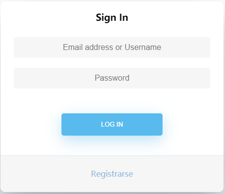

Sign Up: En esta página, el usuario sin cuenta podrá registrarse

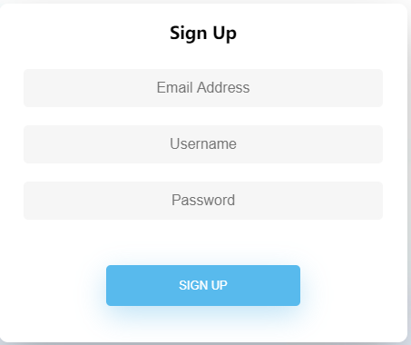

Índice: Es la página principal de los usuarios registrados

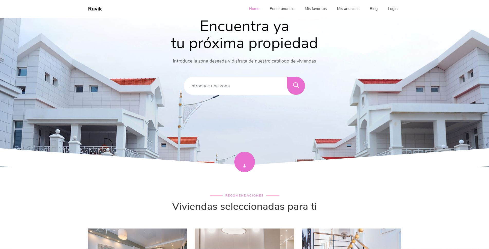

Índice modo visitante: Es la página principal de los usuarios sin registrado, tiene menos funciones que los usuarios registrados

Resultado de búsqueda: Son resultados de la búsqueda

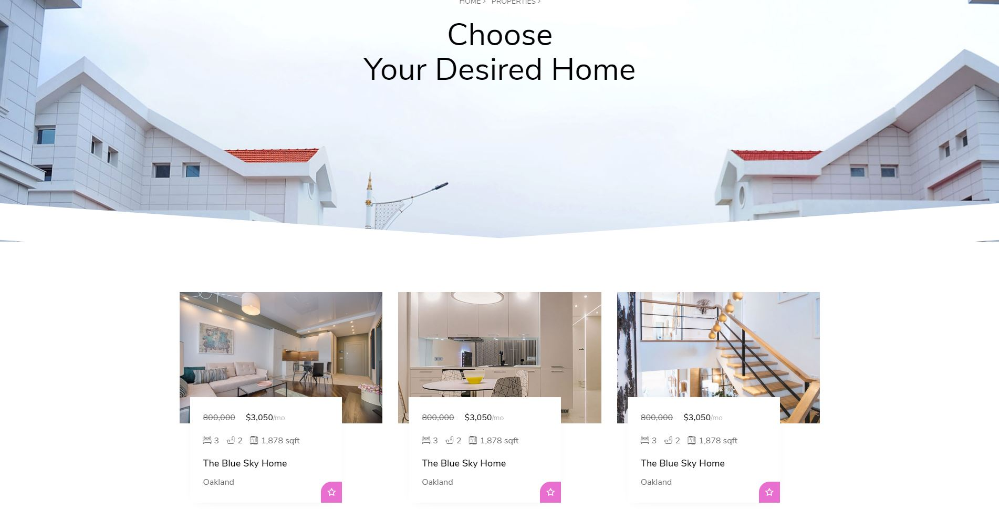

Mis anuncios: Los usuarios registrados pueden ver sus anuncios y modificarlos

Subir un nuevo anuncio: Los usuarios registrados pueden subir anuncios

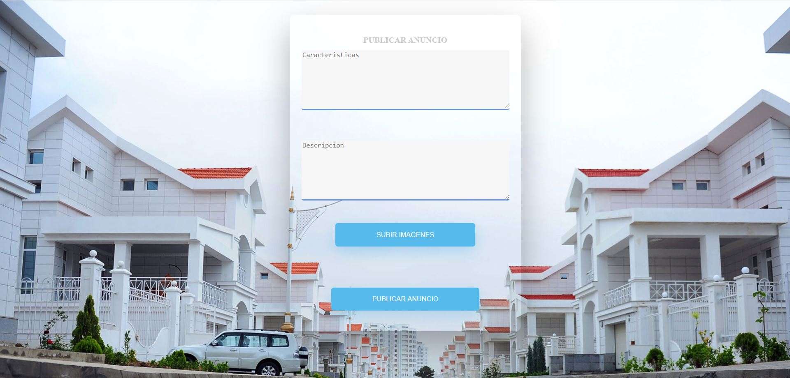

Opiniones: Los usuarios registrados podrá ver las opiniones de los distintos usuarios sobre un anuncio

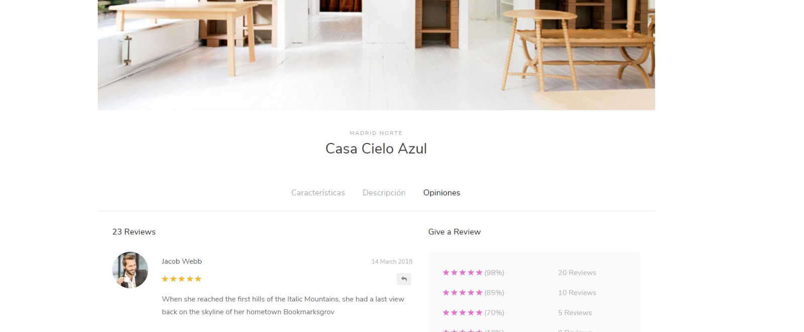

Opiniones modo visitante: Los usuarios sin registrar no podrá ver las opiniones.
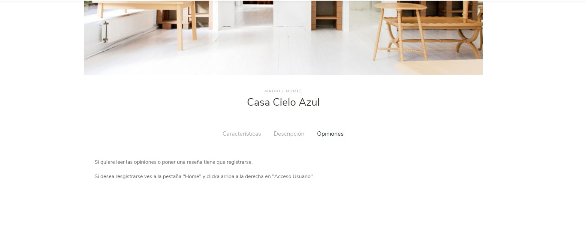

Blog: Sólo los usuarios registrados podrá ver las novedades.

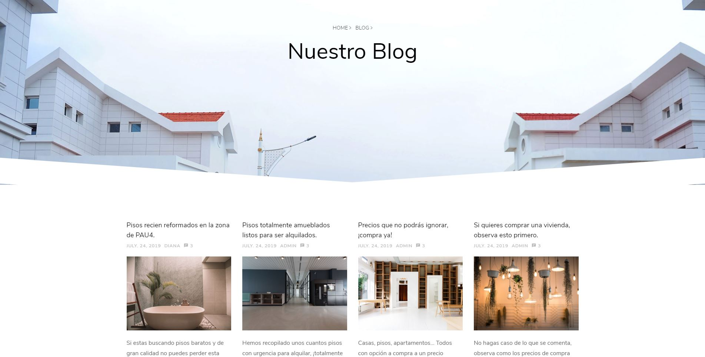

Gráfica: Muestra número de ventas de distintos meses.

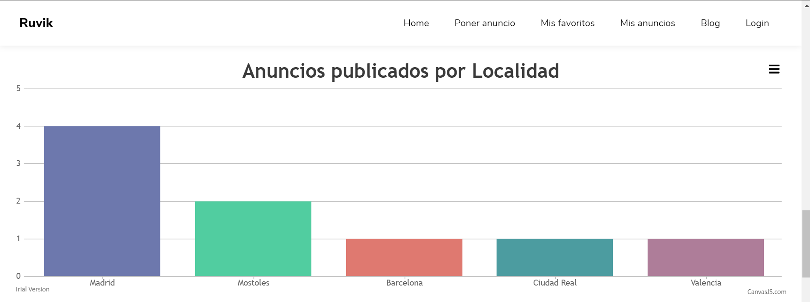

### Diagrama de Navegación

## FASE 2
### Navegación

### Instrucciones de desarrollo

### Diagrama con las entidades de la base de datos

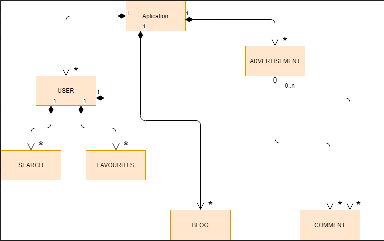

### Diagrama de clases y templates

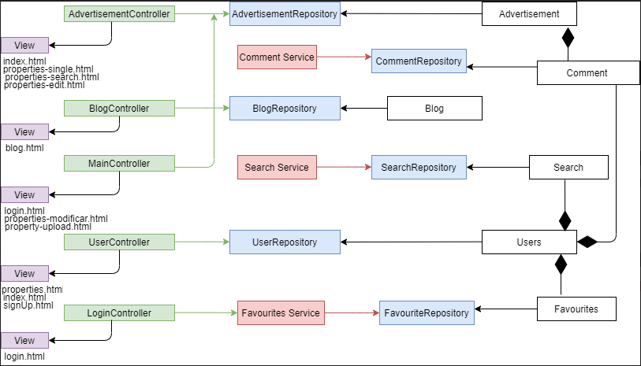

### Participación de miembros

Eduardo Luna Sánchez: 
* Tareas realizadas en la fase: 
  - Implementación del correo como tecnología complementaria. 
  - Creación de entidades. 
  - Cambio en el formulario de subida del anuncio. 
  - Realizar funcionalidades de anuncio. 
  - Realizar diagrama de las entidades de la base de datos. 
  - Realizar diagrama de clases y template. 
  - Cambios en diversos htmls. 
  
 * Listado de los 5 commits más significativos: 
   - New complementary technology 1954f33 
   - Update html 52b568e 
   - Update property-upload f9e0011
   - New class diagram and template diagram 78e4cde
   - Update entities 19f014d 
  
 * Listado de los 5 ficheros que mas se haya participado: 
   - UserController.java
   - UserService.java
   - property-upload.html
   - Advertisement.java
   - Comment.java
